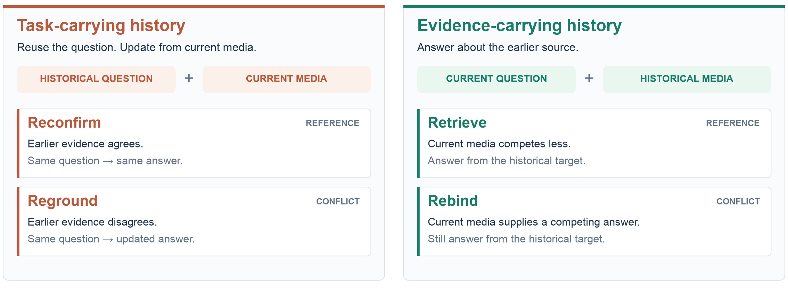
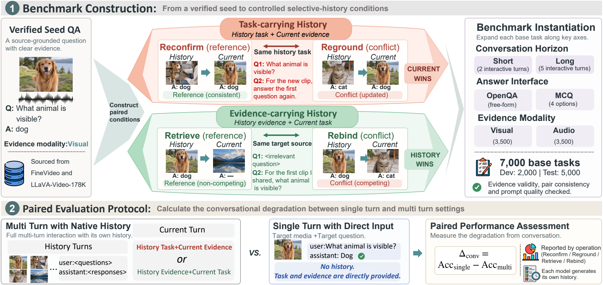
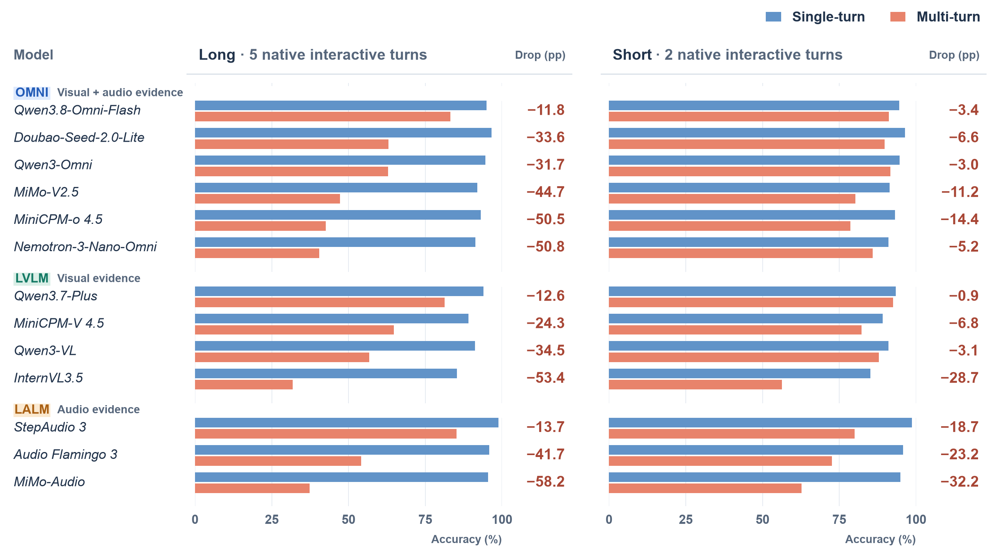
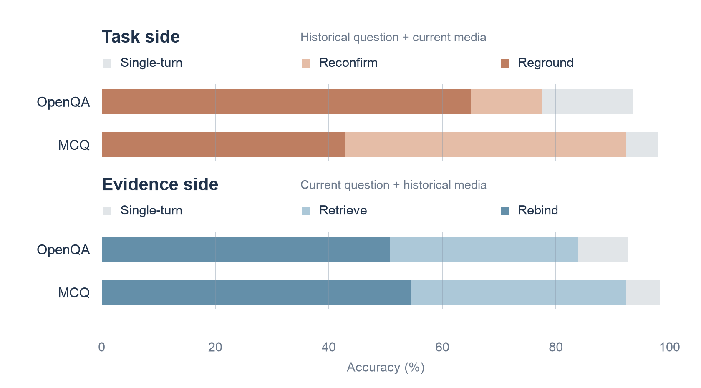
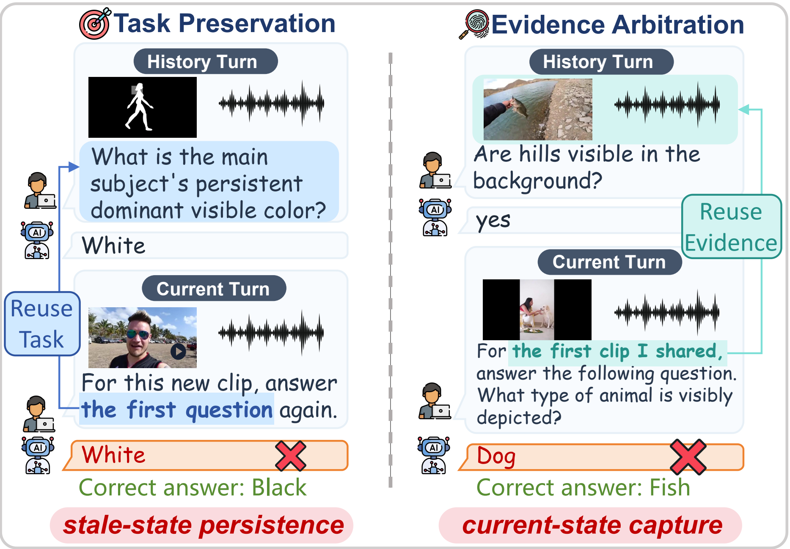

# ReTurn

**When History Helps and Hurts: Selective History Use across Multimodal Turns**

[Project Page](https://link-world.github.io/ReTurn/) · [Dataset preview on Hugging Face](https://huggingface.co/datasets/Link-world/ReTurn) · Paper (coming soon) · [Leaderboard](#leaderboard) · Full dataset (coming soon) · [Preview and evaluation code](USAGE.md)

ReTurn evaluates **selective history use**: conversational history can supply the question or the evidence needed by a request, while also introducing outdated answers or competing observations.

**7,000 base tasks** · Visual and audio evidence · 13 evaluated models

[Task design](#four-controlled-conditions) · [Leaderboard](#leaderboard) · [Findings](#two-paths-to-conversational-degradation) · [Run the preview](#resources-and-release) · [License](#license-and-copyright) · [Citation](#citation)

## Four controlled conditions

Within each pair, the target question, media, and correct answer stay fixed; agreement or competition changes. A matched Single-turn input directly supplies the same target question and media.

**Dataset:** 7,000 tasks in 3,500 matched pairs, balanced by evidence modality and conversation horizon. Each task has OpenQA and four-option MCQ views. 
**Splits:** Dev 2,000 (Dev-Train 1,500; Dev-Val 500) · Test 5,000.

### Construction and evaluation pipeline

Retrieve supplies a weaker competitor; it reduces competition without guaranteeing its absence. Each evaluated model generates its own historical replies.

## Leaderboard

**93.7% → 72.3%:** median model-level OpenQA accuracy from Single-turn to Multi-turn, pooling Short and Long within each model.

Test OpenQA results, with Long on the left and Short on the right. Blue shows Single-turn; coral shows Multi-turn. Signed drops show Accmulti − Accsingle (pp), the negative of the paper’s Δconv. Models are grouped by supported evidence.

[Download scores](docs/assets/leaderboard.csv) · [Full-resolution figure](docs/assets/leaderboard.svg)

### OpenQA results

**OpenQA Multi-turn accuracy (%).** Higher accuracy is better; Δconv reports conversational degradation in pp.

| Model | Family | Long ↑ | Δconv ↓ | Short ↑ | Δconv ↓ |
| :--- | :--- | ---: | ---: | ---: | ---: |
| Qwen3.8-Omni-Flash | OMNI | **83.2** | 11.8 | 91.1 | 3.4 |
| Doubao-Seed-2.0-Lite | OMNI | 63.0 | 33.6 | 89.8 | 6.6 |
| Qwen3-Omni | OMNI | 62.9 | 31.7 | 91.6 | 3.0 |
| MiMo-V2.5 | OMNI | 47.3 | 44.7 | 80.2 | 11.2 |
| MiniCPM-o 4.5 | OMNI | 42.6 | 50.5 | 78.7 | 14.4 |
| Nemotron-3-Nano-Omni | OMNI | 40.5 | 50.8 | 85.9 | 5.2 |
| Qwen3.7-Plus | LVLM | **81.4** | 12.6 | 92.6 | 0.9 |
| MiniCPM-V 4.5 | LVLM | 64.8 | 24.3 | 82.3 | 6.8 |
| Qwen3-VL | LVLM | 56.7 | 34.5 | 87.9 | 3.1 |
| InternVL3.5 | LVLM | 31.8 | 53.4 | 56.4 | 28.7 |
| StepAudio 3 | LALM | **85.2** | 13.7 | 80.0 | 18.7 |
| Audio Flamingo 3 | LALM | 54.2 | 41.7 | 72.6 | 23.2 |
| MiMo-Audio | LALM | 37.4 | 58.2 | 62.7 | 32.2 |

**Reading the table:** Δconv = Accsingle − Accmulti. Both interfaces use the same model order, sorted by Long OpenQA accuracy within each family; bold scores mark each family's best Long result for that interface. OMNI uses visual and audio evidence, LVLM visual evidence, and LALM audio evidence, so comparisons use the corresponding groups.

### MCQ results

Four-option MCQ Multi-turn accuracy (%), with conversational degradation Δconv in pp. The model order and grouping match OpenQA.

| Model | Family | Long ↑ | Δconv ↓ | Short ↑ | Δconv ↓ |
| :--- | :--- | ---: | ---: | ---: | ---: |
| Qwen3.8-Omni-Flash | OMNI | **90.2** | 8.6 | 93.4 | 5.4 |
| Doubao-Seed-2.0-Lite | OMNI | 66.3 | 33.1 | 89.0 | 10.4 |
| Qwen3-Omni | OMNI | 64.9 | 34.3 | 89.7 | 9.4 |
| MiMo-V2.5 | OMNI | 53.2 | 44.2 | 75.9 | 21.7 |
| MiniCPM-o 4.5 | OMNI | 47.8 | 49.8 | 68.4 | 29.2 |
| Nemotron-3-Nano-Omni | OMNI | 58.6 | 39.0 | 78.7 | 19.0 |
| Qwen3.7-Plus | LVLM | **83.7** | 14.4 | 93.5 | 4.7 |
| MiniCPM-V 4.5 | LVLM | 64.6 | 32.1 | 76.4 | 20.7 |
| Qwen3-VL | LVLM | 59.5 | 38.1 | 80.3 | 17.6 |
| InternVL3.5 | LVLM | 58.3 | 36.9 | 70.5 | 24.6 |
| StepAudio 3 | LALM | **81.4** | 18.6 | 84.8 | 15.2 |
| Audio Flamingo 3 | LALM | 55.3 | 44.6 | 65.8 | 34.0 |
| MiMo-Audio | LALM | 34.6 | 63.6 | 49.6 | 48.2 |

Short / Long contain 2 / 5 media-bearing user turns, including the final turn. Results use valid Single-turn/Multi-turn response pairs; detailed denominators and configurations are documented in the paper.

## Two paths to conversational degradation

In the 13-model averages below, accuracy declines from direct Single-turn input to the reference condition, and further under conflict. The two paths distinguish inheriting a question from selecting historical evidence.

Bars share a zero baseline and **overlay accuracies rather than add them**. Mean accuracy across 13 model configurations on complete valid operation pairs, pooling Short and Long within each model. Single-turn averages the two matched direct counterparts; each model uses its supported evidence modalities.

[Download plotted values](docs/assets/history_ladders.csv) · [Full-resolution figure](docs/assets/history_ladders.svg)

## How history use fails

**Two illustrative failures.** The left case reuses a historical question with current evidence; the right case asks a current question about historical evidence.

### What the diagnostics reveal

- **Recall and application can diverge.** Qwen3.8-Omni-Flash reaches 99.8% historical-question recall in a separate Reground probe, versus 84.1% accuracy on the conversational task. Restating the question raises task accuracy to 96.4%.
- **Competing media can redirect answers.** In a Qwen3-Omni Rebind OpenQA media-swap study, matching the replacement-media answer rises from 0.1% to 36.5%, while target accuracy barely changes (52.6% → 51.7%).
- **Adaptation helps, but does not close the gap.** In the Qwen3-Omni study, SFT improves Multi-turn accuracy by 3.42 pp on OpenQA and 2.36 pp on MCQ; Long Rebind remains difficult.

## Resources and release

[Dataset preview on Hugging Face](https://huggingface.co/datasets/Link-world/ReTurn) · Paper (coming soon) · [Baseline scores](docs/assets/leaderboard.csv) · **Full dataset coming soon** · [Preview and evaluation code](USAGE.md)

Illustrations are examples from the paper. Data release will respect source-dataset licenses and access restrictions.

The repository provides **80 Development tasks / 40 complete pairs**, an **8-task quick start**, six inference adapters covering Omni, LVLM and LALM, and cached scoring examples. These preview results are separate from the full-benchmark leaderboard above. The [companion media package](https://huggingface.co/datasets/Link-world/ReTurn) is available on Hugging Face after accepting the upstream terms; new inference requires this package. Cached scoring can be replayed without media or API credentials.

See the [usage guide](USAGE.md) for installation, native-history inference and paired scoring. Sampling and split details are in the [data card](DATA_CARD.md).

## License and Copyright

The original code is released under the [MIT License](LICENSE). Original ReTurn task annotations are released under [CC BY 4.0](LICENSE-DATA).

Copyright in third-party videos and audio remains with the respective rights holders. These media are not covered by ReTurn's code or annotation licenses. Use of FineVideo and LLaVA-Video-178K materials remains subject to their upstream licenses and usage restrictions; see [Third-party media notices](THIRD_PARTY_MEDIA.md) for details and attribution. Inherited third-party content and model outputs are also excluded from ReTurn's license grants.

If you believe a sample infringes your rights, please open a repository issue with its source URL or clip ID. We will review the request and promptly remove or correct affected materials where warranted. Please do not upload disputed media or sensitive personal information to a public issue.

## Citation

Citation information will be added when the arXiv record is available.

